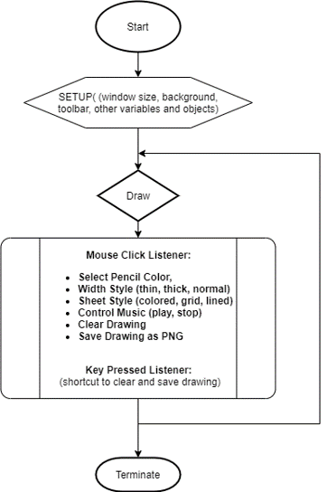
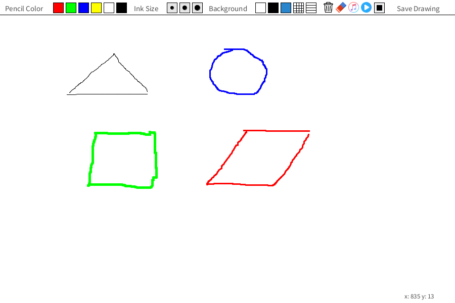
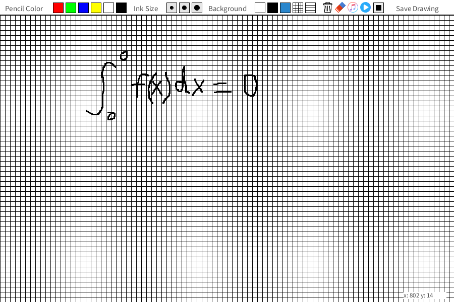
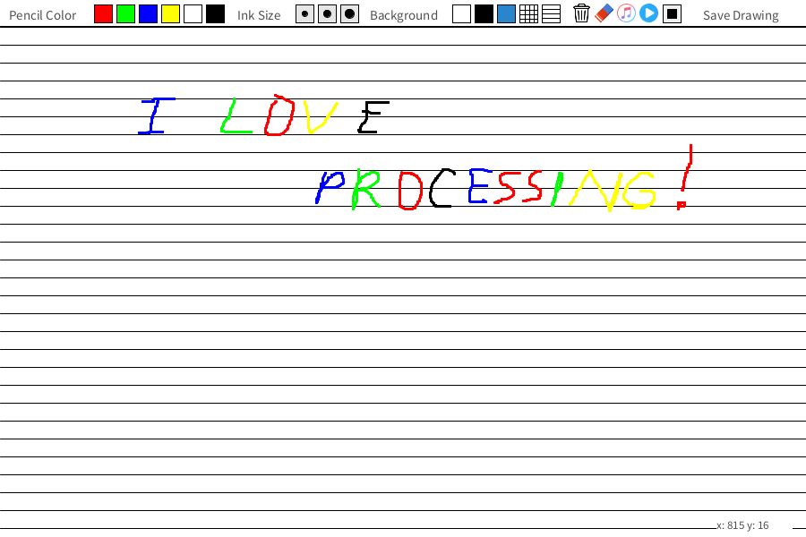

# PPaint
 Paint program written in Processing.

> PPaint v1.0  
> Developers: Husanboy Qodirov & Hasanboy Qodirov  
> Developed as [final project](PPaint_Final_Project.pdf) for Computer Graphics 101  
> Download presentaion file.  
> Written in Processing 4.0b7  
> https://processing.org

## Introduction

* PPaint (Processing Paint) is a program capable of providing general drawing experience with extra featres.
* Written entirely with code (no drag and drop).
* Based on precise calculations to place objects on screen and to manage interactions for them.
* Our goal is not to deliver the best paint program to public, but to show that it is possible to make these sort of programs using Processing only by combining what we have learned in this class.

## Interactions

* mousePressed() - called once aft er every time a mouse button is pressed.
* keyPressed() -  called once every time a key is pressed. The key that was pressed is stored in the key variable.

## Output

saveFrame() - Saves a numbered sequence of images, one image each time the function is run. We use this function to save a drawing user has drawn. It is stored in a local folder as PNG image file.

## Features
1. Draw in 6 different pencil colors
2. Adjust ink size (thin, normal, thick)
3. Choose background style (colored, grid, lined)
4. Eraser and empty sheet tools
5. Coordinates for mouseX and mouseY
6. Prevent drawing on toolbar
7. Listen to music while drawing
8. Save finished drawing as PNG image file

## Process Diagram

## UI & Sample Drawings

